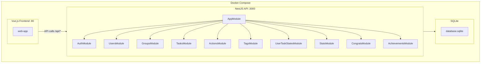

# Migration Express.js vers NestJS - Plan de refactoring

## Vue d'ensemble de l'architecture cible



---

## Phase 1: Nettoyage du projet NestJS

Supprimer les modules inutiles du projet `nest-reference/`:

- `cats/` - module de demo
- `establishments/` - module tourisme  
- `partner-registration/` - module tourisme
- `admin-owner/` - module tourisme
- `owner-overview/` - module tourisme
- `stripe/` - paiement non utilise

Fichiers a modifier:

- [`nest-reference/src/app.module.ts`](nest-reference/src/app.module.ts) - Retirer les imports des modules supprimes
- [`nest-reference/package.json`](nest-reference/package.json) - Renommer le projet en "together-api"

---

## Phase 2: Creation des entites TypeORM

Creer les 9 entites dans `nest-reference/src/`:| Entite | Description | Relations ||--------|-------------|-----------|| User | Utilisateur avec hash bcrypt | ManyToMany Group, OneToMany Action/UserTaskState/Achievement || Group | Groupe avec code unique 8 chars | ManyToMany User, OneToMany Task/Action/Tag/Achievement || Task | Tache avec frequence | ManyToOne Group/Tag, OneToMany Action/UserTaskState || Action | Action realisee | ManyToOne Task/User/Group || Tag | Tag avec couleur hex | ManyToOne Group, OneToMany Task/Congrats || UserTaskState | Etat tache/utilisateur | ManyToOne User/Task || TaskBundle | Bundle de taches | ManyToMany Task, ManyToOne User/Group || Congrats | Message de felicitation | ManyToOne Tag, OneToMany Achievement || Achievement | Accomplissement | ManyToOne User/Group/Congrats |Adapter [`nest-reference/src/users/entities/user.entity.ts`](nest-reference/src/users/entities/user.entity.ts) avec les champs: nom, prenom, pseudo, email, password, icone.---

## Phase 3: Creation des modules NestJS

Structure pour chaque module:

```javascript
module-name/
  dto/
    create-module.dto.ts
    update-module.dto.ts
  entities/
    module.entity.ts
  module.controller.ts
  module.service.ts
  module.module.ts
```

Modules a creer:

1. **groups/** - CRUD + join/leave/hot-actions/addTags/addTasks
2. **tasks/** - CRUD standard
3. **actions/** - CRUD + filtres par user/group/task
4. **tags/** - CRUD + filtre par groupe
5. **user-task-states/** - update + get par groupe
6. **stats/** - overview endpoint
7. **congrats/** - CRUD + filtre par tag
8. **achievements/** - CRUD + filtres + stats

Adapter les modules existants:

- **auth/** - Ajouter register avec tous les champs, rememberMe
- **users/** - Adapter avec getProfile, updateProfile

---

## Phase 4: Services metier

Creer les services specifiques:

1. **HotActionsService** dans `groups/`:

- `getTasksWithHurryState(groupId)` - Calcul des taches en retard
- `getHotTasks(groupId)` - Filtrer taches maybe/yes

2. **StarterPackService** dans `groups/`:

- `getDefaultStarterPackData()` - Lire starter-packs.json
- `addTagsToGroup(group, tags)` 
- `addTasksToGroup(group, tasks)`

3. **Helpers** dans `common/`:

- `hurryCalculation.ts` - Calcul HurryState
- `stats.ts` - frequencyToMonthly

---

## Phase 5: Configuration de l'authentification

Modifier [`nest-reference/src/auth/auth.module.ts`](nest-reference/src/auth/auth.module.ts):

- Utiliser `JWT_SECRET` depuis env au lieu de constante
- Configurer expirations: `JWT_EXPIRES_IN` et `JWT_REMEMBER_EXPIRES_IN`

Modifier [`nest-reference/src/auth/auth.guard.ts`](nest-reference/src/auth/auth.guard.ts):

- Charger le secret depuis ConfigService

Ajouter `RememberMeGuard` pour le endpoint `/auth/remember-me`.---

## Phase 6: Configuration des routes

Toutes les routes doivent etre prefixees par `/api/`:

```typescript
// main.ts
app.setGlobalPrefix('api');
```

Routes a implementer:

- `POST /api/auth/register`, `POST /api/auth/login`, `GET /api/auth/verify`, `GET /api/auth/remember-me`
- `GET/POST/PUT/DELETE /api/users/*`
- `GET/POST/PUT/DELETE /api/groups/*` + `/join`, `/leave`, `/tags`, `/tasks`, `/hot-actions`
- `GET/POST/PUT/DELETE /api/tasks/*`
- `GET/POST/PUT/DELETE /api/actions/*` + filtres
- `GET/POST/PUT/DELETE /api/tags/*`
- `GET/PUT /api/user-task-states/*`
- `GET /api/stats/group/:groupId/overview`
- Congrats et Achievements CRUD

---

## Phase 7: Mise a jour Docker

### Dockerfile (`nest-reference/Dockerfile`)

Le Dockerfile existant est deja bien configure avec stages dev/prod. A conserver tel quel.

### docker-compose.yml

Mettre a jour pour pointer vers `nest-reference/` au lieu de `api/`:

```yaml
services:
  api:
    build:
      context: ./nest-reference
      dockerfile: Dockerfile
    # ... reste de la config
  
  web-app:
    build:
      context: ./web-app
      dockerfile: Dockerfile
    # ... config frontend
```


### Creer Dockerfile pour web-app

Creer `web-app/Dockerfile` pour builder et servir le frontend Vue.js avec nginx.---

## Phase 8: Nettoyage final

1. Supprimer le dossier `api/` une fois la migration validee
2. Renommer `nest-reference/` en `api/` (optionnel)
3. Mettre a jour les docker-compose en consequence
4. Supprimer fichiers de test inutiles du projet NestJS original

---

## Fichiers cles a creer/modifier

| Fichier | Action ||---------|--------|| `nest-reference/src/entities/*.entity.ts` | Creer 9 entites || `nest-reference/src/*/` | Creer 8 nouveaux modules || `nest-reference/src/app.module.ts` | Configurer tous les modules || `nest-reference/src/main.ts` | Ajouter prefix `/api` || `nest-reference/src/data/starter-packs.json` | Copier depuis api/ || `docker-compose*.yml` | Mettre a jour paths || `web-app/Dockerfile` | Creer pour frontend |---

## Notes importantes

- **Compatibilite API**: Les routes doivent rester identiques pour eviter les modifications frontend
- **Base de donnees**: SQLite sera conserve avec `synchronize: true` pour le dev