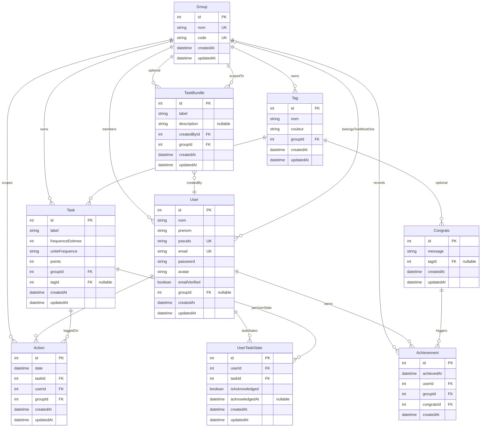

# Modèle de données cible (ER)

**SGBD cible** : PostgreSQL (remplacement de SQLite). Le diagramme ci-dessous est **logique** (indépendant du dialecte SQL).

**Principes métier (refonte)** :

- Chaque **User** appartient à **au plus un** `Group` via `User.groupId` (FK nullable). Plus de table de jointure many-to-many User ↔ Group.
- **`UserTaskState`** : suivi par couple `(user, task)` pour **`isAcknowledged` / `acknowledgedAt`** uniquement (prise de connaissance d’une tâche) — plus de `isConcerned` ni `concernedAt`.
- **`Action`** : déclaration par l’utilisateur authentifié pour le groupe — **plus de** `isHelpingHand` ni d’entité **`ActionAcknowledgment`** (flux « action pour autrui » supprimé).
- Les **stats** restent dérivées des `Action` et des métadonnées `Task` ; pas de tables analytiques obligatoires dans le MVP (voir section stats minimale en fin de document).

**Note TaskBundle** : la table de liaison many-to-many `task_bundle_tasks_task` (TypeORM `@JoinTable` sur `TaskBundle.tasks`) reste telle quelle si on conserve l’entité ; non représentée en détail sur le diagramme pour garder la lisibilité.

## Contraintes d’unicité recommandées (PostgreSQL)

- `User.email`, `User.pseudo` : uniques (déjà le cas).
- `Group.nom`, `Group.code` : uniques (déjà le cas).
- `(Tag.groupId, Tag.nom)` : unique pour respecter l’US « pas deux labels du même nom » dans un groupe.
- `(Task.groupId, Task.label)` : unique pour « pas deux tâches avec le même nom » dans un groupe.
- `UserTaskState (userId, taskId)` : unique (déjà le cas).

## Stats minimal (hors ER)

Un endpoint unique peut agréger sans nouvelle table, par exemple pour l’utilisateur courant et le mois en cours :

- **volume cible** : somme des points mensualisés des tâches du groupe (déjà calculable depuis `Task`) ;
- **points réalisés** : somme des `Action` du mois pour `userId` courant × `task.points` ;
- **tâches en retard** : règle métier sur `Task` + dernières `Action` (ou flag dérivé), alignée sur l’US « hot ».

Les modules **Congrats** / **Achievement** peuvent rester pour la gamification ou être gelés en phase 2 selon priorisation produit.
